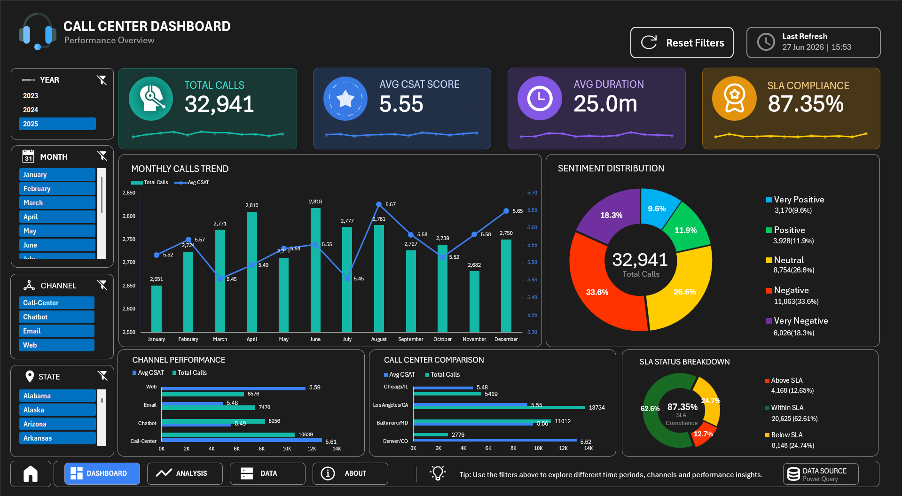

# Call Center Dashboard (Excel)

Interactive dashboard built in Microsoft Excel
for analyzing call center performance.

---

## Dashboard Preview

## Features

- Dynamic KPI cards
- Multi-year analysis
- Interactive slicers
- Pivot Charts
- Power Query transformation
- VBA automation
- Navigation system

---

## Dataset

Source:
Call Center Dataset (Kaggle)

Fields:
- Customer sentiment
- CSAT score
- Call timestamp
- Response time
- Call duration
- Channel
- State

---

## KPIs

- Total Calls
- Avg CSAT Score
- Avg Duration
- SLA Compliance

---

## Tools

Excel  
Power Query  
Pivot Tables  
VBA

---

## File Structure

Dashboard
About
Data

---

## Author

Denis-Valentin Novac
